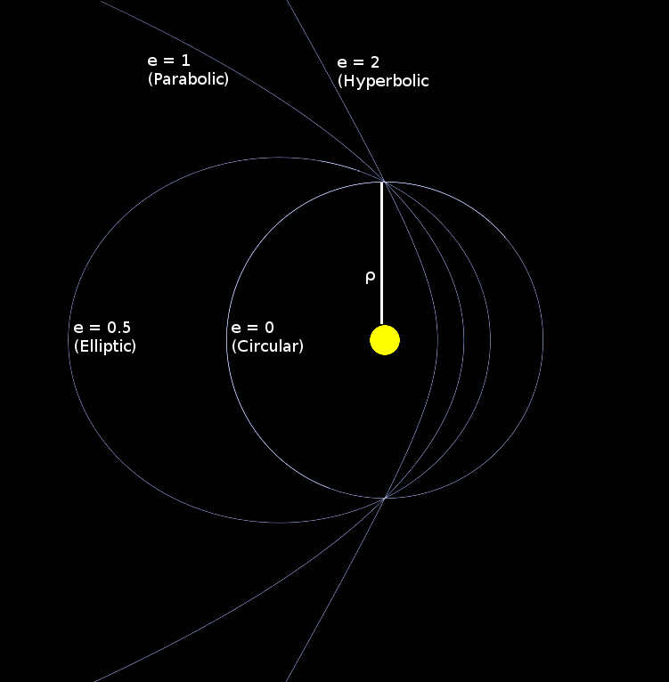

# Help

Main variables:

Name | Description
-----|-------------
Mechanics Timestep         | The time in seconds that acceleration is assumed to be constant for. Set higher for faster simulation, lower for more accurate simulation
Planetary Radii Multiplier | The factor by which the size of bodies are multiplied when drawn to the screen. (At real size, most planets cannot be seen)
Orbit Trail Length         | The length of the trails of each body, as a number of timesteps

Below are descriptions of the various orbital elements you can change

Name | Description | Symbol | Range
-----|-------------|--------|-------
Semi-latus rectum               | the distance between two bodies at right angles to the “periapsis” (minimum point) | ρ | [0,+∞)
Eccentricity                    | A measure of the shape of the orbit, illustrated below                             | e | [0,+∞)
Inclination                     | the angle between the orbital plane and the reference plane                        | i | \[0,180\]
Longitude of the ascending node | the angle from the reference direction anticlockwise to the point where the orbiting body rises above the reference plane | Ω | [0,360)
Argument of periapsis           | the angle from the ascending node anticlockwise to the periapsis.                  | ω | [0,360)
True anomaly                    | the angle from the periapsis anticlockwise to the current position of the body.    | ν | [0,360)

The best way to understand how these work is to modify the variables of an existing system. For each body you can also edit its name and which planet it is orbiting. If it is set to not be orbiting any planet, the orbital elements will be ignored and it will be placed at the origin with 0 velocity.

### Eccentricity/Semi-latus rectum:

### Existing Systems

There are several existing systems to try:

Name                      | Description
--------------------------|------------
Standard                  | Our solar system
Inner                     | The inner 4 planets of our solar system
EccentricityDemo          | A demonstration of how eccentricity affects orbits, as shown above
RoguePlanet1/RoguePlanet2 | Two examples of the effects of a rogue planet entering our solar system
SuperJupiterEarth         | An example of three body mechanics, with earth orbiting a planet much more massive than jupiter
Binary                    | A binary star system, showing non-Keplerian orbital mechanics

### In Simulation Controls:

Control     | Effect
------------|------------
Esc         | Pause and edit variables
L           | camera lock
R           | Reset camera
F           | Change camera focus
C           | Toggle stereoscopic camera
P           | Pause
Mouse       | Move Camera
Scroll      | Zoom
Up/Down     | Increase/Decrease planetary radii multiplier
Right/Left  | Increase/Decrease mechanics timestep
PgUp/PgDown | Increase/Decrease orbit trail length
